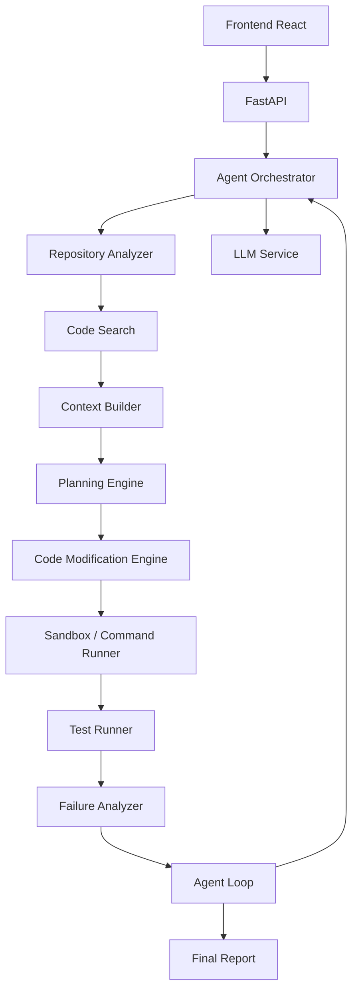

# CodePilot AI

**Autonomous AI Coding Agent for Repository-Level Software Engineering**

CodePilot AI is a resume-level coding agent similar in spirit to a lightweight Cursor / Claude Code workflow. A developer describes a change in natural language. The agent inspects an arbitrary local repository, builds a focused context (not the whole tree), plans, edits files through a tool system, runs allowlisted commands and tests, diagnoses failures, and iterates until the task succeeds or a configured limit is reached.

It is designed to run locally on Windows, work with any local Python (or mixed) project, and keep API keys out of source code.

---

## Project overview

| Piece | Role |
| --- | --- |
| React + Vite UI | Repository picker, task input, live activity, plan, diffs, tests, report |
| FastAPI API | Projects, tasks, SSE event stream, file/diff access, health/metrics |
| Agent orchestrator | Scan → search → plan → tool loop → test → diagnose → report |
| SQLite | Task metadata, events, snapshots, command and test records |
| OpenAI-compatible LLM client | Groq by default; any Chat Completions endpoint |

---

## Architecture



Clear interfaces sit between scanning, retrieval, planning, tools, sandbox execution, and the LLM provider. The agent never sends the full repository to the model. Secret files (`.env`, keys, certificates) are blocked from reads and from LLM context.

---

## Features

- Repository map: tree, types, sizes, config/test/dependency files, project-type detection (FastAPI, Flask, Django, React, Node, Next.js, Python CLI, generic Python)
- Search: exact, regex, filename, symbols, imports — ripgrep when installed, Python fallback otherwise
- Optional embeddings / vector search (`EmbeddingProvider`) — hash fallback, Sentence Transformers optional, not required to boot
- Structured planning (Pydantic JSON)
- Tool calling: `list_files`, `read_file`, `search_code`, `write_file`, `patch_file`, `delete_file`, `run_command`, `run_tests`, `git_diff`, `git_status`
- Snapshots, unified diffs, Python syntax validation on writes
- Command allowlist, timeouts, output caps, no destructive disk/credential commands
- Autonomous test loop (default 5 iterations)
- Git status/diff, optional task branch `codepilot/task/<timestamp>`, rollback
- Modes: **Implement**, **Code Review** (no edits), **Explain**, **Issue**
- SSE live events
- Structured logging, metrics endpoint, SQLite persistence

---

## Technology stack

Python 3.11+ · FastAPI · Pydantic · asyncio · httpx · SQLAlchemy · SQLite · pytest · React · Vite · TypeScript · Docker

---

## Installation (Windows)

From PowerShell, in the `codepilot-ai` folder. Use the Windows launcher `py` (Python 3.11+; 3.11 is recommended because 3.14 may lack prebuilt wheels):

```powershell
copy .env.example .env
py -3.11 -m venv .venv
.\.venv\Scripts\Activate.ps1
python -m pip install --upgrade pip
pip install -r backend\requirements.txt
cd frontend
npm install
cd ..
npm install
```

Or run `.\scripts\setup.ps1`.

Edit `.env` and set `LLM_API_KEY`.

---

## Environment variables

| Variable | Purpose |
| --- | --- |
| `LLM_API_KEY` | Provider API key (never commit this) |
| `LLM_BASE_URL` | OpenAI-compatible base URL (default Groq) |
| `LLM_MODEL` | Model id |
| `DATABASE_URL` | SQLite URL |
| `AGENT_MAX_ITERATIONS` | Test/repair loop cap |
| `ALLOWED_COMMANDS` | Comma-separated command allowlist |
| `EMBEDDINGS_ENABLED` | Optional semantic index |

Frontend API URL (in `frontend/.env`): `VITE_API_BASE_URL=http://127.0.0.1:8010`

See `.env.example` for the full set.

---

## Start CodePilot (development)

From the **project root** (not `frontend/`):

1. Create/activate the virtual environment and install Python + Node dependencies if you have not already (see Installation above). Also run `npm install` in the project root once (dev launcher).
2. Set `LLM_API_KEY` in `.env`.
3. Start both servers with one command:

```powershell
npm run dev
```

Windows fallback (same thing): double-click `start_codepilot.bat` or run it from a Command Prompt.

Then open:

- Frontend: http://localhost:5174
- Backend: http://127.0.0.1:8010
- Health: http://127.0.0.1:8010/health

The launcher will not silently pick another port. If **5174** or **8010** is already in use, startup fails with a clear error.

Stop with Ctrl+C so both processes exit.

Optional split terminals:

```powershell
npm run dev:backend
npm run dev:frontend
```

---

## Running with Docker

Create `.env`, then:

```powershell
docker compose up --build
```

- API: http://localhost:8000
- UI: http://localhost:8080

The compose file mounts `sample_projects` at `/workspace/sample_projects` inside the backend container. Register that path (or another mounted repo) when running in Docker. Host paths like `C:\...` are **not** visible inside the container unless you add a volume.

---

## Example usage

1. Run `npm run dev` from the project root, then open http://localhost:5174.
2. Register repository: `C:\Users\...\codepilot-ai\sample_projects\demo_fastapi`
3. Task: `Add a /health endpoint.`
4. Mode: Implement → **Run Agent**.

Other examples:

- Implement: `Add JWT authentication to this FastAPI project.`
- Review: `Review this project for production issues.`
- Explain: `Explain how items routing works in this repository.`
- Issue: `Fix issue #123: GET /items/{id} should return 404 for unknown ids.` (the demo already does; try a real local issue description)

---

## Agent workflow

TASK → UNDERSTAND (scan/search) → PLAN → IMPLEMENT (tools) → TEST → on failure ANALYZE → UPDATE → IMPLEMENT FIX → TEST AGAIN → FINAL REPORT.

Default max iterations: 5.

---

## Security model

- All file and command operations are bounded to the selected repository root (path traversal rejected).
- `.env`, private keys, and common secret filenames are never read into LLM context.
- Commands are parsed and allowlisted; `rm -rf`, `del`, `format`, env dumps, and destructive git flags are denied.
- Timeouts and stdout/stderr size limits apply.
- API keys are redacted in logs.
- Review mode does not write files by policy of the prompt; implement/issue modes use the tool sandbox only (no unrestricted shell writes).

---

## API documentation

| Method | Path | Description |
| --- | --- | --- |
| POST | `/api/projects` | Register a local repo |
| GET | `/api/projects` | List projects |
| GET | `/api/projects/{id}` | Project metadata |
| POST | `/api/projects/{id}/scan` | Rescan / repo map |
| GET | `/api/projects/{id}/files` | List files |
| GET | `/api/projects/{id}/file` | Read a file |
| GET | `/api/projects/{id}/diff` | Git diff |
| POST | `/api/agent/tasks` | Start a task |
| GET | `/api/agent/tasks/{id}` | Task + report |
| POST | `/api/agent/tasks/{id}/cancel` | Cancel |
| POST | `/api/agent/tasks/{id}/rollback` | `git restore` |
| GET | `/api/agent/tasks/{id}/events` | SSE stream |
| GET | `/health` | Liveness |
| GET | `/metrics` | Counters and timers |

Interactive docs: `/docs`.

SSE events include `agent_started`, `repository_scanned`, `search_completed`, `plan_created`, `tool_*`, `test_*`, `iteration_started`, `agent_completed`, `agent_failed`.

---

## Testing

```powershell
.\.venv\Scripts\Activate.ps1
cd backend
pytest -q
```

Demo app tests:

```powershell
cd sample_projects\demo_fastapi
pytest -q
```

---

## Troubleshooting

| Symptom | What to check |
| --- | --- |
| `Invalid LLM API key` | `LLM_API_KEY` in `.env`, restart uvicorn |
| Frontend cannot reach API / API offline | Run `npm run dev` from the repo root so the API is on **8010** and Vite on **5174**. Confirm http://127.0.0.1:8010/health. Check `frontend/.env` `VITE_API_BASE_URL=http://127.0.0.1:8010`. |
| Repository does not exist | Use an absolute Windows path that this machine can read |
| Command blocked | Binary must be on `ALLOWED_COMMANDS`; no `..` or deny-list patterns |
| Tests not found | Agent runs `pytest` inside the **selected repo**, not CodePilot itself |
| Docker cannot see `C:\...` | Mount the repo into the backend container |

---

## Future improvements

- Human approval gate before applying diffs
- Persistent vector DB (Chroma/Qdrant) and real embedding APIs
- Multi-file patch format (UDiff) with conflict handling
- Evaluation harness (SWE-bench-style tasks)
- Per-language sandboxes and containerized command execution
- AuthN for the API if exposed beyond localhost

---

## How this project demonstrates AI Engineering skills

- **Python / FastAPI / API development** — versioned HTTP API, SSE, CORS, Pydantic request/response models.
- **LLM integration** — provider-agnostic OpenAI-compatible client (Groq today, OpenAI or local gateways tomorrow) with usage metrics and structured error handling.
- **Agentic AI + tool calling** — the model selects validated tools; the runtime executes them, never raw unconstrained shell.
- **RAG / code retrieval** — keyword, regex, symbol, and optional vector search feed a token-budgeted context builder.
- **Embeddings / vector search** — `EmbeddingProvider` interface, local JSON index, optional Sentence Transformers.
- **Repository understanding** — language-aware scan, ignore rules, project-type detection, import/symbol parse.
- **Prompt engineering** — separate system prompts for analysis, plan, implement, failure analysis, review, explain, and final report.
- **Autonomous software engineering** — plan → edit → test → diagnose loop with iteration caps.
- **Test-driven agent loops + failure recovery** — pytest runner, traceback-aware diagnosis, re-implementation.
- **Database engineering** — SQLAlchemy models for projects, tasks, events, snapshots, changes, commands, tests.
- **Docker** — backend image, frontend nginx image, compose stack.
- **Security** — path bounds, secret file blocking, command policy, log redaction.
- **Observability** — structured logs, latency timers, `/metrics`.
- **Evaluation** — unit tests for scanner, search, security, commands, patching, state, API, test runner, failure analyzer, plus an integration test on `sample_projects/demo_fastapi`.
# copilot_ai

